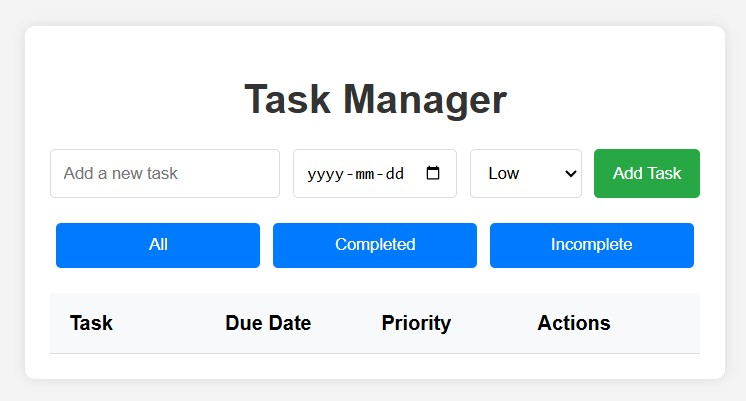
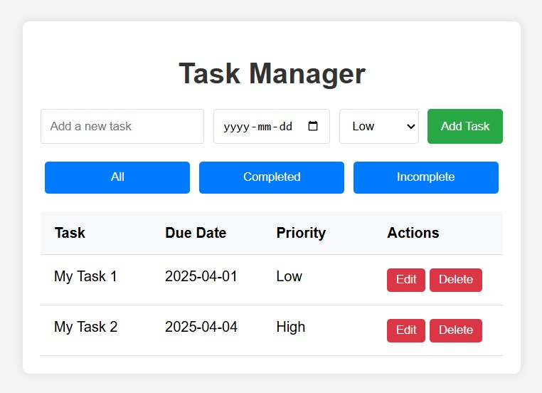
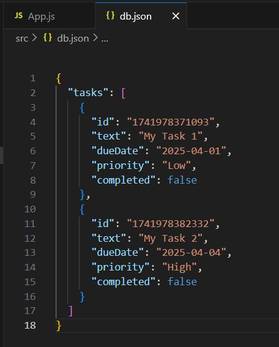

 
 
 
Task Manager
A simple and intuitive Task Manager application built with React and JSON Server. This application allows users to manage their tasks efficiently by adding, editing, deleting, and marking tasks as completed. It also supports features like due dates, task priorities, and filtering tasks by completion status.

Features
Add Tasks: Add new tasks with a description, due date, and priority (Low, Medium, High).

Edit Tasks: Update task details such as the description, due date, and priority.

Delete Tasks: Remove tasks that are no longer needed.

Mark Tasks as Completed: Toggle the completion status of tasks.

Filter Tasks: Filter tasks by:

All: Show all tasks.

Completed: Show only completed tasks.

Incomplete: Show only incomplete tasks.

Persistent Data: Tasks are saved to a backend (JSON Server) and persist even after refreshing the page.

Technologies Used
Frontend:

React (JavaScript library for building user interfaces)

CSS (for styling)

Backend:

JSON Server (mock REST API for storing tasks)

Development Tools:

Create React App (for bootstrapping the React project)

npm (package manager)

How to Set Up and Run the Project
Prerequisites
Node.js and npm installed on your machine.

Basic knowledge of React and REST APIs.

Step 1: Clone the Repository
Clone the repository to your local machine:

bash
Copy
git clone https://github.com/your-username/task-manager.git
cd task-manager
Step 2: Install Dependencies
Install the required dependencies for the React app:

bash
Copy
npm install
Step 3: Set Up JSON Server
Install JSON Server globally (if not already installed):

bash
Copy
npm install -g json-server
Start the JSON Server:

bash
Copy
json-server --watch db.json --port 3001
This will start the backend server at http://localhost:3001 and use db.json as the database.

Step 4: Start the React App
In a new terminal, start the React development server:

bash
Copy
npm start
The app will be available at http://localhost:3000.

How to Use the Task Manager
Add a Task:

Enter the task description in the input field.

Select a due date and priority.

Click the Add Task button.

Edit a Task:

Click the Edit button next to the task you want to modify.

Update the task details (description, due date, or priority).

Click the Save button to save your changes.

Delete a Task:

Click the Delete button next to the task you want to remove.

Mark a Task as Completed:

Click the task description to toggle its completion status.

Filter Tasks:

Use the filter buttons (All, Completed, Incomplete) to view tasks based on their completion status.

Project Structure
Copy
task-manager/
├── public/
├── src/
│   ├── App.js          # Main React component
│   ├── App.css         # Styles for the application
│   ├── index.js        # Entry point for the React app
│   └── ...             # Other React components and utilities
├── db.json             # JSON Server database file
├── package.json        # Project dependencies and scripts
└── README.md           # Project documentation
Screenshots
Task Manager Screenshot
Add, edit, and manage your tasks with ease.

Contributing
Contributions are welcome! If you'd like to contribute to this project, please follow these steps:

Fork the repository.

Create a new branch for your feature or bugfix.

Commit your changes and push them to your fork.

Submit a pull request with a detailed description of your changes.

Acknowledgments
React for the frontend framework.

JSON Server for the mock backend.

Create React App for bootstrapping the project.
